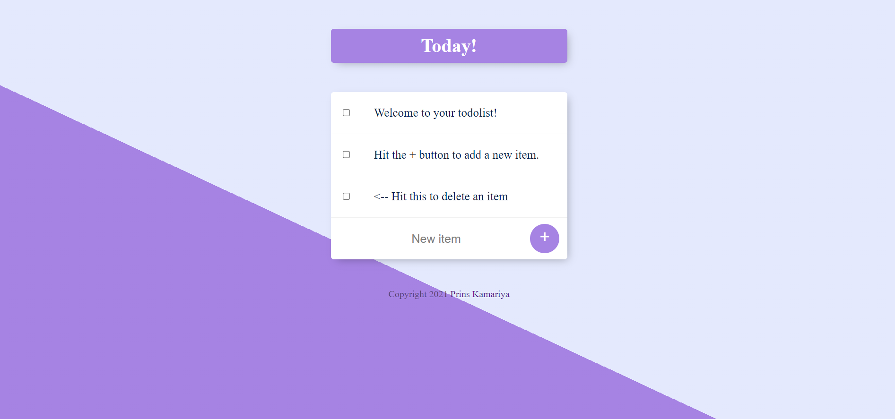
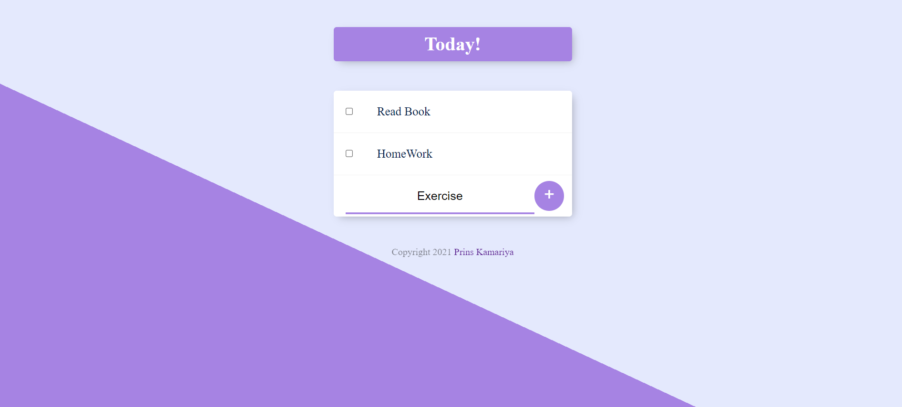

# To Do List
 
A simple to do list web app that allows the user to add items on their to do list and cross them off when completed. The user also has the ability to create multiple to-do lists such as /work /home using different routes like here when you start the server it will started at localhost:3000 so if you change your route to localhost:3000/work then New To DO List will be create for work and it's Title will be work apart from that Home Page List.
## Built With

- Node.JS
- Express
- EJS
- MongoDB
- Javascript
- CSS
- HTML


## Screenshots






## Run Locally

Clone the project

```bash
  git clone https://github.com/prins2003/ToDo-List.git
```

Go to the project directory

```bash
  cd ToDo-List
```

Install dependencies

```bash
  npm install
```

Start the server

```bash
  node app.js
```

